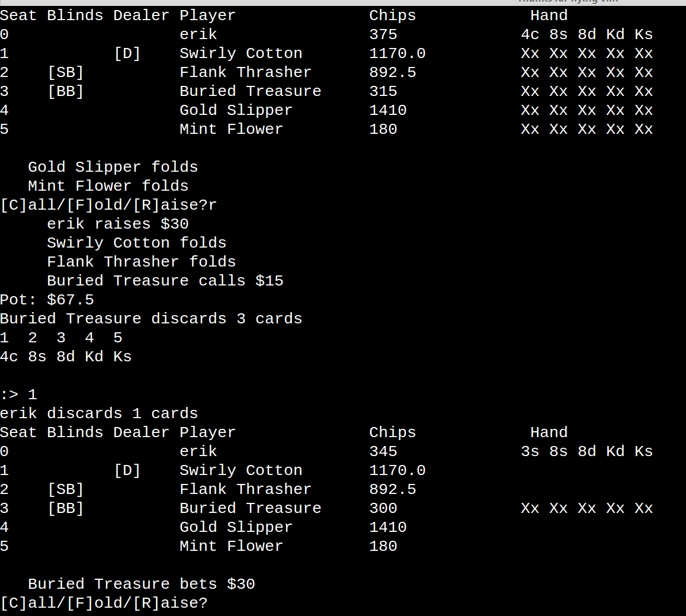

PonyUp Poker
===============

> Poker framework: Tools for creating custom card games and poker variations.



* Author: Erik Lunna
* Date Started: 01-01-2016

## Requirements

Python 3

## Running 
```
python3 run.py
```

## Running tests
```
python3 -m runtests.py
```

# Features

### Cards and Decks
The Deck class constructs a standard 52 card deck. Subclasses available to extend the regular Deck include:
* Blackjack Deck
* Standard Deck with one joker
* Standard Deck with two jokers
* Pinochle Deck
* Piquet Deck

### Poker 
The rules of poker hands are enforced by the evaluator module, which has the
facilities to evaluate poker hands, values, and ranks. I am currently using a
scoring system to compare different hands. 

The structure of different poker variations are managed on a high level by the
sessions module. Currently these subclasses of Session offer these types of poker:
* Five card stud
* Five card draw

The structure of a single hand of poker is managed by the poker module. Since
most poker varients share the same pattern of setting up, cards, and betting,
this module serves as the main resource for creating different Sessions.

Other important modules:
* Betting module: Manages the structure of a single betting round. There are
    usually 2-5 rounds of betting in any hand of poker, depending on the
    variant.
* Pots module: This manages the size of the pot, and divides the pot in case
    of ties or all-in situations.
* Hand module: Manages the Cards in a poker hand.
* Handhistory module: Keeps a log of each hand in a poker session and writes
    it to an external file with a unique session name and timestamp.
* Lobby module: The list of tables is kept in a separate sqlite database,
    and this accesses that database to show which tables are available in
    different table sizes, stakes, and game variants.

### Poker Table
In the table module we have the Table class, which governs Seats. Since in the
long term this could be an online site - I wanted to have flexibility with
players possibly multitabling. 

A Seat object manages a player, their stack of chips, and their poker hand. When 
I first approached the Table I had it managing Players directly, but this
doesn't allow for player to be at multiple tables. The Seat object lets them
have multiple stacks at multiple tables, while the Player manages their money in
their own "bank" account.

#### Keeping cards hidden

To keep cards from being exposed to the computer players (or other human
players), Cards are automatically created and dealt face-down. The Card object
has a 'hidden' boolean variable that tracks if it is facedown or faceup. For your player
to "see" their cards I implemented a peek method to the Card and Hand classes
that let's us see our cards without turning them faceup to the table.


### Computer AI and strategies
To make the computer interesting to play against, I implemented a Strategy class
which simply has the computer make different decisions based on few game
variables:
* The current betlevel
* How much of a bet they are facing
* Their handvalue
* Their player type

There are 4 player types: FISH, LION, JACKAL, and MOUSE - based on Phil
Hellmuth's classic generalized types in his book Play Poker Like the Pros.

Right now the Strategy object is fairly limited, but it does offer variety in
playing against the computer. It is implemented as a series of if-else decisions
which determine the best passive or aggressive action to take, but I envision 
using a decision tree to streamline it in future versions.

This model also has limitations when it comes to games like Five or Seven Card
Stud, where more information is available about opponents hands. We'll also have
challenges with Holdem - where hand values are extremely dependant on the
community cards.

More variety, and unpredictability, can be added to opponents by implementing a
"bluff" or "aggression" variable. This would be a percentage that they would take an
aggressive action instead of a passive one. We could also incorporate a
"trickyness" attribute that would do the opposite - play a strong hand by taking
a passive action instead of the typical aggressive one.


### Testing tools - the tools module
Since there are many things to test, there is a plethora of premade poker hands
in the tools module so we can create any of the regular poker hand ranks, or
other combos of cards for easy testing.
```
# Get a list of 4 random cards
>>> h = tools.get_cards(4) 
>>> h
[5s, 7s, 9s, 2s]

# Get a Royal Flush as a list of 5 cards
>>> h = tools.make('royalflush')
>>> h
[As, Ks, Js, Ts, Qs]

# Convert a list of suitable strings into a list of Cards
>>> cards = tools.convert_to_cards(['As', 'Kc'])  
>>> cards
[As, Kc]
```

### License

This project is licensed under the MIT License.


### Todo

todo: deck.py -  Add faceup arg to deal
todo: Main menu View Help
todo: Option: Speed
todo: Option: View Odds (TOGGLE)
todo: Show BB, effBB, stacksize.(TOGGLE)
todo: Hand strength display(TOGGLE)
todo: Auto sort cards(TOGGLE)
todo: Implement The Grind - and CPU basic strategies(4 types?)

Chips need gold color
Chips need correct decimals
Add time delay and option to change
Fix: Doesn't say when someone wins from folds
Fix: Stud - Seat one has button?
todo: Add q to quit while betting
todo: Use proper ID instead of making a random number for sessions and gameids
fix: Input space
